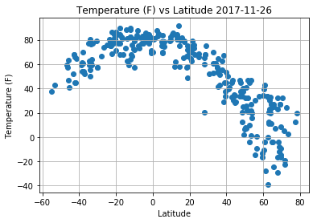
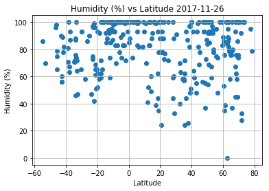
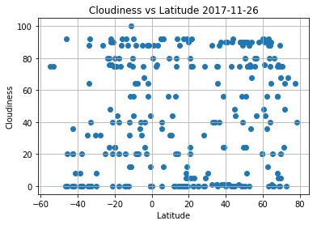
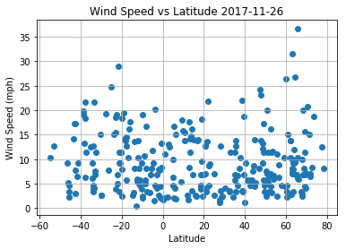

```python
# HW6 - WeatherPy Final Rev

# Dependencies

import numpy as np
import csv
import os
import pandas as pd
import matplotlib.pyplot as plt
import requests as req
import random
import api_keys
import json
import citipy as city
import datetime

# Open Weather Map API Key

weather_key = api_keys.WEATHERKEY
```


```python
# Generate 600 random lat and long but with the following qualification (balanced distribution
# from 0 to 90 and 0 to -90 for lat) and (balanced distribution from 0 to 180 and 0 to -180 for long)  

init_lat = []
init_long = []
final_city = []
final_country = []

for i in range(600):

    # Generate random lat/longs using random functions
    
    new_lat = random.randint(-90, 90) + random.random()
    new_long = random.randint(-180, 180) + random.random()
    init_lat.append(new_lat)
    init_long.append(new_long)

    # Use citypy function of nearest_city to identify the nearest cities associated to the random lat/longs
    # Append the final_city and final_country lists

    new_city = city.nearest_city(new_lat, new_long)
    final_city.append(new_city.city_name)
    final_country.append(new_city.country_code)

# Create a new DataFrame to store the needed data of city and country

world_cities_sample_df = pd.DataFrame(final_city)
world_cities_sample_df = world_cities_sample_df.rename(columns={0:'City'})
world_cities_sample_df["Country"] = final_country

# Remove duplicate cities on the data frame

world_cities_sample_df = world_cities_sample_df.drop_duplicates()

# Duplicate the world_cities DataFrame to iterate weather data

cities_temp = world_cities_sample_df
cities_temp.head(10)
```


<div>
<style>
    .dataframe thead tr:only-child th {
        text-align: right;
    }

    .dataframe thead th {
        text-align: left;
    }

    .dataframe tbody tr th {
        vertical-align: top;
    }
</style>
<table border="1" class="dataframe">
  <thead>
    <tr style="text-align: right;">
      <th></th>
      <th>City</th>
      <th>Country</th>
    </tr>
  </thead>
  <tbody>
    <tr>
      <th>0</th>
      <td>busselton</td>
      <td>au</td>
    </tr>
    <tr>
      <th>1</th>
      <td>gnjilane</td>
      <td>rs</td>
    </tr>
    <tr>
      <th>2</th>
      <td>torbay</td>
      <td>ca</td>
    </tr>
    <tr>
      <th>3</th>
      <td>avera</td>
      <td>pf</td>
    </tr>
    <tr>
      <th>4</th>
      <td>lalibela</td>
      <td>et</td>
    </tr>
    <tr>
      <th>5</th>
      <td>arraial do cabo</td>
      <td>br</td>
    </tr>
    <tr>
      <th>6</th>
      <td>cidreira</td>
      <td>br</td>
    </tr>
    <tr>
      <th>7</th>
      <td>caravelas</td>
      <td>br</td>
    </tr>
    <tr>
      <th>8</th>
      <td>sibu</td>
      <td>my</td>
    </tr>
    <tr>
      <th>9</th>
      <td>arauco</td>
      <td>cl</td>
    </tr>
  </tbody>
</table>
</div>


```python
# Save weather data config information

url = "http://api.openweathermap.org/data/2.5/weather"

parameters = {'appid': weather_key,
          'q': '',
          'units': 'Imperial'}

weather_data = []

# Loop through the list of cities and perform a request for data on each

for index, city in cities_temp.iterrows():
    # Get weather data
    parameters['q'] = city["City"] + "," + city["Country"] 
    response = req.get(url, params=parameters, ).json()
    
    # Print of each city as they are getting processed

    print(city["City"])
    print(url + "?appid=" + weather_key + "&q=" + str(city["City"])+ "," + str(city["Country"])+
             "&units=" + "Imperial") 

    if response["cod"] == 200:

        weather_data.append(response)

    else:

        # Remove the city from the main data frame

        world_cities_sample_df = world_cities_sample_df.loc[world_cities_sample_df["City"] != city["City"]]


#print(json.dumps(weather_data, indent=4, sort_keys=True))
```

    busselton
    http://api.openweathermap.org/data/2.5/weather?appid=0738152741105955d4f9420f9a281f39&q=busselton,au&units=Imperial
    gnjilane
    http://api.openweathermap.org/data/2.5/weather?appid=0738152741105955d4f9420f9a281f39&q=gnjilane,rs&units=Imperial
    torbay
    http://api.openweathermap.org/data/2.5/weather?appid=0738152741105955d4f9420f9a281f39&q=torbay,ca&units=Imperial
    avera
    http://api.openweathermap.org/data/2.5/weather?appid=0738152741105955d4f9420f9a281f39&q=avera,pf&units=Imperial
    lalibela
    http://api.openweathermap.org/data/2.5/weather?appid=0738152741105955d4f9420f9a281f39&q=lalibela,et&units=Imperial
    arraial do cabo
    http://api.openweathermap.org/data/2.5/weather?appid=0738152741105955d4f9420f9a281f39&q=arraial do cabo,br&units=Imperial
    cidreira
    http://api.openweathermap.org/data/2.5/weather?appid=0738152741105955d4f9420f9a281f39&q=cidreira,br&units=Imperial
    caravelas
    http://api.openweathermap.org/data/2.5/weather?appid=0738152741105955d4f9420f9a281f39&q=caravelas,br&units=Imperial
    sibu
    http://api.openweathermap.org/data/2.5/weather?appid=0738152741105955d4f9420f9a281f39&q=sibu,my&units=Imperial
    arauco
    http://api.openweathermap.org/data/2.5/weather?appid=0738152741105955d4f9420f9a281f39&q=arauco,cl&units=Imperial
    lieksa
    http://api.openweathermap.org/data/2.5/weather?appid=0738152741105955d4f9420f9a281f39&q=lieksa,fi&units=Imperial
    kijang
    http://api.openweathermap.org/data/2.5/weather?appid=0738152741105955d4f9420f9a281f39&q=kijang,id&units=Imperial
    kuva
    http://api.openweathermap.org/data/2.5/weather?appid=0738152741105955d4f9420f9a281f39&q=kuva,uz&units=Imperial
    fortuna
    http://api.openweathermap.org/data/2.5/weather?appid=0738152741105955d4f9420f9a281f39&q=fortuna,us&units=Imperial
    ponta do sol
    http://api.openweathermap.org/data/2.5/weather?appid=0738152741105955d4f9420f9a281f39&q=ponta do sol,cv&units=Imperial
    coihaique
    http://api.openweathermap.org/data/2.5/weather?appid=0738152741105955d4f9420f9a281f39&q=coihaique,cl&units=Imperial
    wanning
    http://api.openweathermap.org/data/2.5/weather?appid=0738152741105955d4f9420f9a281f39&q=wanning,cn&units=Imperial
    nizhneyansk
    http://api.openweathermap.org/data/2.5/weather?appid=0738152741105955d4f9420f9a281f39&q=nizhneyansk,ru&units=Imperial
    kavaratti
    http://api.openweathermap.org/data/2.5/weather?appid=0738152741105955d4f9420f9a281f39&q=kavaratti,in&units=Imperial
    ushuaia
    http://api.openweathermap.org/data/2.5/weather?appid=0738152741105955d4f9420f9a281f39&q=ushuaia,ar&units=Imperial
    mataura
    http://api.openweathermap.org/data/2.5/weather?appid=0738152741105955d4f9420f9a281f39&q=mataura,pf&units=Imperial
    punta arenas
    http://api.openweathermap.org/data/2.5/weather?appid=0738152741105955d4f9420f9a281f39&q=punta arenas,cl&units=Imperial
    vaini
    http://api.openweathermap.org/data/2.5/weather?appid=0738152741105955d4f9420f9a281f39&q=vaini,to&units=Imperial
    necochea
    http://api.openweathermap.org/data/2.5/weather?appid=0738152741105955d4f9420f9a281f39&q=necochea,ar&units=Imperial
    bambous virieux
    http://api.openweathermap.org/data/2.5/weather?appid=0738152741105955d4f9420f9a281f39&q=bambous virieux,mu&units=Imperial
    gazanjyk
    http://api.openweathermap.org/data/2.5/weather?appid=0738152741105955d4f9420f9a281f39&q=gazanjyk,tm&units=Imperial
    new norfolk
    http://api.openweathermap.org/data/2.5/weather?appid=0738152741105955d4f9420f9a281f39&q=new norfolk,au&units=Imperial
    butaritari
    http://api.openweathermap.org/data/2.5/weather?appid=0738152741105955d4f9420f9a281f39&q=butaritari,ki&units=Imperial
    hilo
    http://api.openweathermap.org/data/2.5/weather?appid=0738152741105955d4f9420f9a281f39&q=hilo,us&units=Imperial
    cabo san lucas
    http://api.openweathermap.org/data/2.5/weather?appid=0738152741105955d4f9420f9a281f39&q=cabo san lucas,mx&units=Imperial
    albany
    http://api.openweathermap.org/data/2.5/weather?appid=0738152741105955d4f9420f9a281f39&q=albany,au&units=Imperial
    drayton valley
    http://api.openweathermap.org/data/2.5/weather?appid=0738152741105955d4f9420f9a281f39&q=drayton valley,ca&units=Imperial
    bluff
    http://api.openweathermap.org/data/2.5/weather?appid=0738152741105955d4f9420f9a281f39&q=bluff,nz&units=Imperial
    cape town
    http://api.openweathermap.org/data/2.5/weather?appid=0738152741105955d4f9420f9a281f39&q=cape town,za&units=Imperial
    price
    http://api.openweathermap.org/data/2.5/weather?appid=0738152741105955d4f9420f9a281f39&q=price,us&units=Imperial
    kapaa
    http://api.openweathermap.org/data/2.5/weather?appid=0738152741105955d4f9420f9a281f39&q=kapaa,us&units=Imperial
    narsaq
    http://api.openweathermap.org/data/2.5/weather?appid=0738152741105955d4f9420f9a281f39&q=narsaq,gl&units=Imperial
    binga
    http://api.openweathermap.org/data/2.5/weather?appid=0738152741105955d4f9420f9a281f39&q=binga,cd&units=Imperial
    taolanaro
    http://api.openweathermap.org/data/2.5/weather?appid=0738152741105955d4f9420f9a281f39&q=taolanaro,mg&units=Imperial
    vardo
    http://api.openweathermap.org/data/2.5/weather?appid=0738152741105955d4f9420f9a281f39&q=vardo,no&units=Imperial
    hobart
    http://api.openweathermap.org/data/2.5/weather?appid=0738152741105955d4f9420f9a281f39&q=hobart,au&units=Imperial
    patiya
    http://api.openweathermap.org/data/2.5/weather?appid=0738152741105955d4f9420f9a281f39&q=patiya,bd&units=Imperial
    shestakovo
    http://api.openweathermap.org/data/2.5/weather?appid=0738152741105955d4f9420f9a281f39&q=shestakovo,ru&units=Imperial
    egvekinot
    http://api.openweathermap.org/data/2.5/weather?appid=0738152741105955d4f9420f9a281f39&q=egvekinot,ru&units=Imperial
    allanridge
    http://api.openweathermap.org/data/2.5/weather?appid=0738152741105955d4f9420f9a281f39&q=allanridge,za&units=Imperial
    matara
    http://api.openweathermap.org/data/2.5/weather?appid=0738152741105955d4f9420f9a281f39&q=matara,lk&units=Imperial
    aktash
    http://api.openweathermap.org/data/2.5/weather?appid=0738152741105955d4f9420f9a281f39&q=aktash,ru&units=Imperial
    iqaluit
    http://api.openweathermap.org/data/2.5/weather?appid=0738152741105955d4f9420f9a281f39&q=iqaluit,ca&units=Imperial
    chickasha
    http://api.openweathermap.org/data/2.5/weather?appid=0738152741105955d4f9420f9a281f39&q=chickasha,us&units=Imperial
    port alfred
    http://api.openweathermap.org/data/2.5/weather?appid=0738152741105955d4f9420f9a281f39&q=port alfred,za&units=Imperial
    rikitea
    http://api.openweathermap.org/data/2.5/weather?appid=0738152741105955d4f9420f9a281f39&q=rikitea,pf&units=Imperial
    barrow
    http://api.openweathermap.org/data/2.5/weather?appid=0738152741105955d4f9420f9a281f39&q=barrow,us&units=Imperial
    ilulissat
    http://api.openweathermap.org/data/2.5/weather?appid=0738152741105955d4f9420f9a281f39&q=ilulissat,gl&units=Imperial
    amarillo
    http://api.openweathermap.org/data/2.5/weather?appid=0738152741105955d4f9420f9a281f39&q=amarillo,us&units=Imperial
    belushya guba
    http://api.openweathermap.org/data/2.5/weather?appid=0738152741105955d4f9420f9a281f39&q=belushya guba,ru&units=Imperial
    hami
    http://api.openweathermap.org/data/2.5/weather?appid=0738152741105955d4f9420f9a281f39&q=hami,cn&units=Imperial
    umm lajj
    http://api.openweathermap.org/data/2.5/weather?appid=0738152741105955d4f9420f9a281f39&q=umm lajj,sa&units=Imperial
    kodiak
    http://api.openweathermap.org/data/2.5/weather?appid=0738152741105955d4f9420f9a281f39&q=kodiak,us&units=Imperial
    kattivakkam
    http://api.openweathermap.org/data/2.5/weather?appid=0738152741105955d4f9420f9a281f39&q=kattivakkam,in&units=Imperial
    kupang
    http://api.openweathermap.org/data/2.5/weather?appid=0738152741105955d4f9420f9a281f39&q=kupang,id&units=Imperial
    tidore
    http://api.openweathermap.org/data/2.5/weather?appid=0738152741105955d4f9420f9a281f39&q=tidore,id&units=Imperial
    san quintin
    http://api.openweathermap.org/data/2.5/weather?appid=0738152741105955d4f9420f9a281f39&q=san quintin,mx&units=Imperial
    tyukhtet
    http://api.openweathermap.org/data/2.5/weather?appid=0738152741105955d4f9420f9a281f39&q=tyukhtet,ru&units=Imperial
    nobres
    http://api.openweathermap.org/data/2.5/weather?appid=0738152741105955d4f9420f9a281f39&q=nobres,br&units=Imperial
    bethel
    http://api.openweathermap.org/data/2.5/weather?appid=0738152741105955d4f9420f9a281f39&q=bethel,us&units=Imperial
    hermosillo
    http://api.openweathermap.org/data/2.5/weather?appid=0738152741105955d4f9420f9a281f39&q=hermosillo,mx&units=Imperial
    kailua
    http://api.openweathermap.org/data/2.5/weather?appid=0738152741105955d4f9420f9a281f39&q=kailua,us&units=Imperial
    gigmoto
    http://api.openweathermap.org/data/2.5/weather?appid=0738152741105955d4f9420f9a281f39&q=gigmoto,ph&units=Imperial
    bolshiye uki
    http://api.openweathermap.org/data/2.5/weather?appid=0738152741105955d4f9420f9a281f39&q=bolshiye uki,ru&units=Imperial
    okhotsk
    http://api.openweathermap.org/data/2.5/weather?appid=0738152741105955d4f9420f9a281f39&q=okhotsk,ru&units=Imperial
    lavrentiya
    http://api.openweathermap.org/data/2.5/weather?appid=0738152741105955d4f9420f9a281f39&q=lavrentiya,ru&units=Imperial
    charters towers
    http://api.openweathermap.org/data/2.5/weather?appid=0738152741105955d4f9420f9a281f39&q=charters towers,au&units=Imperial
    podgornoye
    http://api.openweathermap.org/data/2.5/weather?appid=0738152741105955d4f9420f9a281f39&q=podgornoye,ru&units=Imperial
    avarua
    http://api.openweathermap.org/data/2.5/weather?appid=0738152741105955d4f9420f9a281f39&q=avarua,ck&units=Imperial
    noyabrsk
    http://api.openweathermap.org/data/2.5/weather?appid=0738152741105955d4f9420f9a281f39&q=noyabrsk,ru&units=Imperial
    aklavik
    http://api.openweathermap.org/data/2.5/weather?appid=0738152741105955d4f9420f9a281f39&q=aklavik,ca&units=Imperial
    mount gambier
    http://api.openweathermap.org/data/2.5/weather?appid=0738152741105955d4f9420f9a281f39&q=mount gambier,au&units=Imperial
    khandyga
    http://api.openweathermap.org/data/2.5/weather?appid=0738152741105955d4f9420f9a281f39&q=khandyga,ru&units=Imperial
    atuona
    http://api.openweathermap.org/data/2.5/weather?appid=0738152741105955d4f9420f9a281f39&q=atuona,pf&units=Imperial
    rundu
    http://api.openweathermap.org/data/2.5/weather?appid=0738152741105955d4f9420f9a281f39&q=rundu,na&units=Imperial
    kokopo
    http://api.openweathermap.org/data/2.5/weather?appid=0738152741105955d4f9420f9a281f39&q=kokopo,pg&units=Imperial
    glendive
    http://api.openweathermap.org/data/2.5/weather?appid=0738152741105955d4f9420f9a281f39&q=glendive,us&units=Imperial
    guerrero negro
    http://api.openweathermap.org/data/2.5/weather?appid=0738152741105955d4f9420f9a281f39&q=guerrero negro,mx&units=Imperial
    dzhusaly
    http://api.openweathermap.org/data/2.5/weather?appid=0738152741105955d4f9420f9a281f39&q=dzhusaly,kz&units=Imperial
    dikson
    http://api.openweathermap.org/data/2.5/weather?appid=0738152741105955d4f9420f9a281f39&q=dikson,ru&units=Imperial
    prudnik
    http://api.openweathermap.org/data/2.5/weather?appid=0738152741105955d4f9420f9a281f39&q=prudnik,pl&units=Imperial
    hithadhoo
    http://api.openweathermap.org/data/2.5/weather?appid=0738152741105955d4f9420f9a281f39&q=hithadhoo,mv&units=Imperial
    nikolskoye
    http://api.openweathermap.org/data/2.5/weather?appid=0738152741105955d4f9420f9a281f39&q=nikolskoye,ru&units=Imperial
    saskylakh
    http://api.openweathermap.org/data/2.5/weather?appid=0738152741105955d4f9420f9a281f39&q=saskylakh,ru&units=Imperial
    qaanaaq
    http://api.openweathermap.org/data/2.5/weather?appid=0738152741105955d4f9420f9a281f39&q=qaanaaq,gl&units=Imperial
    victoria
    http://api.openweathermap.org/data/2.5/weather?appid=0738152741105955d4f9420f9a281f39&q=victoria,sc&units=Imperial
    mutsamudu
    http://api.openweathermap.org/data/2.5/weather?appid=0738152741105955d4f9420f9a281f39&q=mutsamudu,km&units=Imperial
    mar del plata
    http://api.openweathermap.org/data/2.5/weather?appid=0738152741105955d4f9420f9a281f39&q=mar del plata,ar&units=Imperial
    bulgan
    http://api.openweathermap.org/data/2.5/weather?appid=0738152741105955d4f9420f9a281f39&q=bulgan,mn&units=Imperial
    puerto ayora
    http://api.openweathermap.org/data/2.5/weather?appid=0738152741105955d4f9420f9a281f39&q=puerto ayora,ec&units=Imperial
    pangkalanbuun
    http://api.openweathermap.org/data/2.5/weather?appid=0738152741105955d4f9420f9a281f39&q=pangkalanbuun,id&units=Imperial
    cabatuan
    http://api.openweathermap.org/data/2.5/weather?appid=0738152741105955d4f9420f9a281f39&q=cabatuan,ph&units=Imperial
    broome
    http://api.openweathermap.org/data/2.5/weather?appid=0738152741105955d4f9420f9a281f39&q=broome,au&units=Imperial
    bredasdorp
    http://api.openweathermap.org/data/2.5/weather?appid=0738152741105955d4f9420f9a281f39&q=bredasdorp,za&units=Imperial
    vaitupu
    http://api.openweathermap.org/data/2.5/weather?appid=0738152741105955d4f9420f9a281f39&q=vaitupu,wf&units=Imperial
    beloretsk
    http://api.openweathermap.org/data/2.5/weather?appid=0738152741105955d4f9420f9a281f39&q=beloretsk,ru&units=Imperial
    onega
    http://api.openweathermap.org/data/2.5/weather?appid=0738152741105955d4f9420f9a281f39&q=onega,ru&units=Imperial
    xai-xai
    http://api.openweathermap.org/data/2.5/weather?appid=0738152741105955d4f9420f9a281f39&q=xai-xai,mz&units=Imperial
    pevek
    http://api.openweathermap.org/data/2.5/weather?appid=0738152741105955d4f9420f9a281f39&q=pevek,ru&units=Imperial
    beisfjord
    http://api.openweathermap.org/data/2.5/weather?appid=0738152741105955d4f9420f9a281f39&q=beisfjord,no&units=Imperial
    talnakh
    http://api.openweathermap.org/data/2.5/weather?appid=0738152741105955d4f9420f9a281f39&q=talnakh,ru&units=Imperial
    ribeira grande
    http://api.openweathermap.org/data/2.5/weather?appid=0738152741105955d4f9420f9a281f39&q=ribeira grande,pt&units=Imperial
    ola
    http://api.openweathermap.org/data/2.5/weather?appid=0738152741105955d4f9420f9a281f39&q=ola,ru&units=Imperial
    karpathos
    http://api.openweathermap.org/data/2.5/weather?appid=0738152741105955d4f9420f9a281f39&q=karpathos,gr&units=Imperial
    tuktoyaktuk
    http://api.openweathermap.org/data/2.5/weather?appid=0738152741105955d4f9420f9a281f39&q=tuktoyaktuk,ca&units=Imperial
    atar
    http://api.openweathermap.org/data/2.5/weather?appid=0738152741105955d4f9420f9a281f39&q=atar,mr&units=Imperial
    hasaki
    http://api.openweathermap.org/data/2.5/weather?appid=0738152741105955d4f9420f9a281f39&q=hasaki,jp&units=Imperial
    front royal
    http://api.openweathermap.org/data/2.5/weather?appid=0738152741105955d4f9420f9a281f39&q=front royal,us&units=Imperial
    illoqqortoormiut
    http://api.openweathermap.org/data/2.5/weather?appid=0738152741105955d4f9420f9a281f39&q=illoqqortoormiut,gl&units=Imperial
    sivaki
    http://api.openweathermap.org/data/2.5/weather?appid=0738152741105955d4f9420f9a281f39&q=sivaki,ru&units=Imperial
    hecun
    http://api.openweathermap.org/data/2.5/weather?appid=0738152741105955d4f9420f9a281f39&q=hecun,cn&units=Imperial
    klaksvik
    http://api.openweathermap.org/data/2.5/weather?appid=0738152741105955d4f9420f9a281f39&q=klaksvik,fo&units=Imperial
    tasiilaq
    http://api.openweathermap.org/data/2.5/weather?appid=0738152741105955d4f9420f9a281f39&q=tasiilaq,gl&units=Imperial
    rodino
    http://api.openweathermap.org/data/2.5/weather?appid=0738152741105955d4f9420f9a281f39&q=rodino,ru&units=Imperial
    hermanus
    http://api.openweathermap.org/data/2.5/weather?appid=0738152741105955d4f9420f9a281f39&q=hermanus,za&units=Imperial
    severo-kurilsk
    http://api.openweathermap.org/data/2.5/weather?appid=0738152741105955d4f9420f9a281f39&q=severo-kurilsk,ru&units=Imperial
    tuatapere
    http://api.openweathermap.org/data/2.5/weather?appid=0738152741105955d4f9420f9a281f39&q=tuatapere,nz&units=Imperial
    placer
    http://api.openweathermap.org/data/2.5/weather?appid=0738152741105955d4f9420f9a281f39&q=placer,ph&units=Imperial
    tezu
    http://api.openweathermap.org/data/2.5/weather?appid=0738152741105955d4f9420f9a281f39&q=tezu,in&units=Imperial
    tsukumi
    http://api.openweathermap.org/data/2.5/weather?appid=0738152741105955d4f9420f9a281f39&q=tsukumi,jp&units=Imperial
    brae
    http://api.openweathermap.org/data/2.5/weather?appid=0738152741105955d4f9420f9a281f39&q=brae,gb&units=Imperial
    dunedin
    http://api.openweathermap.org/data/2.5/weather?appid=0738152741105955d4f9420f9a281f39&q=dunedin,nz&units=Imperial
    beyneu
    http://api.openweathermap.org/data/2.5/weather?appid=0738152741105955d4f9420f9a281f39&q=beyneu,kz&units=Imperial
    katsuura
    http://api.openweathermap.org/data/2.5/weather?appid=0738152741105955d4f9420f9a281f39&q=katsuura,jp&units=Imperial
    afyonkarahisar
    http://api.openweathermap.org/data/2.5/weather?appid=0738152741105955d4f9420f9a281f39&q=afyonkarahisar,tr&units=Imperial
    sakaraha
    http://api.openweathermap.org/data/2.5/weather?appid=0738152741105955d4f9420f9a281f39&q=sakaraha,mg&units=Imperial
    georgetown
    http://api.openweathermap.org/data/2.5/weather?appid=0738152741105955d4f9420f9a281f39&q=georgetown,sh&units=Imperial
    zyryanka
    http://api.openweathermap.org/data/2.5/weather?appid=0738152741105955d4f9420f9a281f39&q=zyryanka,ru&units=Imperial
    solovetskiy
    http://api.openweathermap.org/data/2.5/weather?appid=0738152741105955d4f9420f9a281f39&q=solovetskiy,ru&units=Imperial
    sawtell
    http://api.openweathermap.org/data/2.5/weather?appid=0738152741105955d4f9420f9a281f39&q=sawtell,au&units=Imperial
    puerto del rosario
    http://api.openweathermap.org/data/2.5/weather?appid=0738152741105955d4f9420f9a281f39&q=puerto del rosario,es&units=Imperial
    waipawa
    http://api.openweathermap.org/data/2.5/weather?appid=0738152741105955d4f9420f9a281f39&q=waipawa,nz&units=Imperial
    jamestown
    http://api.openweathermap.org/data/2.5/weather?appid=0738152741105955d4f9420f9a281f39&q=jamestown,sh&units=Imperial
    lebu
    http://api.openweathermap.org/data/2.5/weather?appid=0738152741105955d4f9420f9a281f39&q=lebu,cl&units=Imperial
    provideniya
    http://api.openweathermap.org/data/2.5/weather?appid=0738152741105955d4f9420f9a281f39&q=provideniya,ru&units=Imperial
    alice springs
    http://api.openweathermap.org/data/2.5/weather?appid=0738152741105955d4f9420f9a281f39&q=alice springs,au&units=Imperial
    bandarbeyla
    http://api.openweathermap.org/data/2.5/weather?appid=0738152741105955d4f9420f9a281f39&q=bandarbeyla,so&units=Imperial
    malidong
    http://api.openweathermap.org/data/2.5/weather?appid=0738152741105955d4f9420f9a281f39&q=malidong,ph&units=Imperial
    airai
    http://api.openweathermap.org/data/2.5/weather?appid=0738152741105955d4f9420f9a281f39&q=airai,pw&units=Imperial
    mendahara
    http://api.openweathermap.org/data/2.5/weather?appid=0738152741105955d4f9420f9a281f39&q=mendahara,id&units=Imperial
    dakar
    http://api.openweathermap.org/data/2.5/weather?appid=0738152741105955d4f9420f9a281f39&q=dakar,sn&units=Imperial
    domoni
    http://api.openweathermap.org/data/2.5/weather?appid=0738152741105955d4f9420f9a281f39&q=domoni,km&units=Imperial
    omboue
    http://api.openweathermap.org/data/2.5/weather?appid=0738152741105955d4f9420f9a281f39&q=omboue,ga&units=Imperial
    puerto escondido
    http://api.openweathermap.org/data/2.5/weather?appid=0738152741105955d4f9420f9a281f39&q=puerto escondido,mx&units=Imperial
    prestea
    http://api.openweathermap.org/data/2.5/weather?appid=0738152741105955d4f9420f9a281f39&q=prestea,gh&units=Imperial
    risaralda
    http://api.openweathermap.org/data/2.5/weather?appid=0738152741105955d4f9420f9a281f39&q=risaralda,co&units=Imperial
    mandurah
    http://api.openweathermap.org/data/2.5/weather?appid=0738152741105955d4f9420f9a281f39&q=mandurah,au&units=Imperial
    amderma
    http://api.openweathermap.org/data/2.5/weather?appid=0738152741105955d4f9420f9a281f39&q=amderma,ru&units=Imperial
    chagda
    http://api.openweathermap.org/data/2.5/weather?appid=0738152741105955d4f9420f9a281f39&q=chagda,ru&units=Imperial
    great yarmouth
    http://api.openweathermap.org/data/2.5/weather?appid=0738152741105955d4f9420f9a281f39&q=great yarmouth,gb&units=Imperial
    sao joao da barra
    http://api.openweathermap.org/data/2.5/weather?appid=0738152741105955d4f9420f9a281f39&q=sao joao da barra,br&units=Imperial
    esperance
    http://api.openweathermap.org/data/2.5/weather?appid=0738152741105955d4f9420f9a281f39&q=esperance,au&units=Imperial
    cayenne
    http://api.openweathermap.org/data/2.5/weather?appid=0738152741105955d4f9420f9a281f39&q=cayenne,gf&units=Imperial
    longyearbyen
    http://api.openweathermap.org/data/2.5/weather?appid=0738152741105955d4f9420f9a281f39&q=longyearbyen,sj&units=Imperial
    townsville
    http://api.openweathermap.org/data/2.5/weather?appid=0738152741105955d4f9420f9a281f39&q=townsville,au&units=Imperial
    snezhnogorsk
    http://api.openweathermap.org/data/2.5/weather?appid=0738152741105955d4f9420f9a281f39&q=snezhnogorsk,ru&units=Imperial
    anyksciai
    http://api.openweathermap.org/data/2.5/weather?appid=0738152741105955d4f9420f9a281f39&q=anyksciai,lt&units=Imperial
    campoverde
    http://api.openweathermap.org/data/2.5/weather?appid=0738152741105955d4f9420f9a281f39&q=campoverde,pe&units=Imperial
    yellowknife
    http://api.openweathermap.org/data/2.5/weather?appid=0738152741105955d4f9420f9a281f39&q=yellowknife,ca&units=Imperial
    cherskiy
    http://api.openweathermap.org/data/2.5/weather?appid=0738152741105955d4f9420f9a281f39&q=cherskiy,ru&units=Imperial
    port elizabeth
    http://api.openweathermap.org/data/2.5/weather?appid=0738152741105955d4f9420f9a281f39&q=port elizabeth,za&units=Imperial
    ust-barguzin
    http://api.openweathermap.org/data/2.5/weather?appid=0738152741105955d4f9420f9a281f39&q=ust-barguzin,ru&units=Imperial
    vao
    http://api.openweathermap.org/data/2.5/weather?appid=0738152741105955d4f9420f9a281f39&q=vao,nc&units=Imperial
    mareeba
    http://api.openweathermap.org/data/2.5/weather?appid=0738152741105955d4f9420f9a281f39&q=mareeba,au&units=Imperial
    kazalinsk
    http://api.openweathermap.org/data/2.5/weather?appid=0738152741105955d4f9420f9a281f39&q=kazalinsk,kz&units=Imperial
    upernavik
    http://api.openweathermap.org/data/2.5/weather?appid=0738152741105955d4f9420f9a281f39&q=upernavik,gl&units=Imperial
    araci
    http://api.openweathermap.org/data/2.5/weather?appid=0738152741105955d4f9420f9a281f39&q=araci,br&units=Imperial
    bilibino
    http://api.openweathermap.org/data/2.5/weather?appid=0738152741105955d4f9420f9a281f39&q=bilibino,ru&units=Imperial
    zhuanghe
    http://api.openweathermap.org/data/2.5/weather?appid=0738152741105955d4f9420f9a281f39&q=zhuanghe,cn&units=Imperial
    pisco
    http://api.openweathermap.org/data/2.5/weather?appid=0738152741105955d4f9420f9a281f39&q=pisco,pe&units=Imperial
    luwuk
    http://api.openweathermap.org/data/2.5/weather?appid=0738152741105955d4f9420f9a281f39&q=luwuk,id&units=Imperial
    castro
    http://api.openweathermap.org/data/2.5/weather?appid=0738152741105955d4f9420f9a281f39&q=castro,cl&units=Imperial
    north bend
    http://api.openweathermap.org/data/2.5/weather?appid=0738152741105955d4f9420f9a281f39&q=north bend,us&units=Imperial
    shar
    http://api.openweathermap.org/data/2.5/weather?appid=0738152741105955d4f9420f9a281f39&q=shar,kz&units=Imperial
    khatanga
    http://api.openweathermap.org/data/2.5/weather?appid=0738152741105955d4f9420f9a281f39&q=khatanga,ru&units=Imperial
    banjar
    http://api.openweathermap.org/data/2.5/weather?appid=0738152741105955d4f9420f9a281f39&q=banjar,id&units=Imperial
    mys shmidta
    http://api.openweathermap.org/data/2.5/weather?appid=0738152741105955d4f9420f9a281f39&q=mys shmidta,ru&units=Imperial
    novosemeykino
    http://api.openweathermap.org/data/2.5/weather?appid=0738152741105955d4f9420f9a281f39&q=novosemeykino,ru&units=Imperial
    acapulco
    http://api.openweathermap.org/data/2.5/weather?appid=0738152741105955d4f9420f9a281f39&q=acapulco,mx&units=Imperial
    kidal
    http://api.openweathermap.org/data/2.5/weather?appid=0738152741105955d4f9420f9a281f39&q=kidal,ml&units=Imperial
    nhulunbuy
    http://api.openweathermap.org/data/2.5/weather?appid=0738152741105955d4f9420f9a281f39&q=nhulunbuy,au&units=Imperial
    pabianice
    http://api.openweathermap.org/data/2.5/weather?appid=0738152741105955d4f9420f9a281f39&q=pabianice,pl&units=Imperial
    bengkulu
    http://api.openweathermap.org/data/2.5/weather?appid=0738152741105955d4f9420f9a281f39&q=bengkulu,id&units=Imperial
    tucupita
    http://api.openweathermap.org/data/2.5/weather?appid=0738152741105955d4f9420f9a281f39&q=tucupita,ve&units=Imperial
    grand river south east
    http://api.openweathermap.org/data/2.5/weather?appid=0738152741105955d4f9420f9a281f39&q=grand river south east,mu&units=Imperial
    saldanha
    http://api.openweathermap.org/data/2.5/weather?appid=0738152741105955d4f9420f9a281f39&q=saldanha,za&units=Imperial
    mahebourg
    http://api.openweathermap.org/data/2.5/weather?appid=0738152741105955d4f9420f9a281f39&q=mahebourg,mu&units=Imperial
    conceicao da barra
    http://api.openweathermap.org/data/2.5/weather?appid=0738152741105955d4f9420f9a281f39&q=conceicao da barra,br&units=Imperial
    merauke
    http://api.openweathermap.org/data/2.5/weather?appid=0738152741105955d4f9420f9a281f39&q=merauke,id&units=Imperial
    sur
    http://api.openweathermap.org/data/2.5/weather?appid=0738152741105955d4f9420f9a281f39&q=sur,om&units=Imperial
    piacabucu
    http://api.openweathermap.org/data/2.5/weather?appid=0738152741105955d4f9420f9a281f39&q=piacabucu,br&units=Imperial
    salalah
    http://api.openweathermap.org/data/2.5/weather?appid=0738152741105955d4f9420f9a281f39&q=salalah,om&units=Imperial
    leeuwarden
    http://api.openweathermap.org/data/2.5/weather?appid=0738152741105955d4f9420f9a281f39&q=leeuwarden,nl&units=Imperial
    kegayli
    http://api.openweathermap.org/data/2.5/weather?appid=0738152741105955d4f9420f9a281f39&q=kegayli,uz&units=Imperial
    canaries
    http://api.openweathermap.org/data/2.5/weather?appid=0738152741105955d4f9420f9a281f39&q=canaries,lc&units=Imperial
    ambon
    http://api.openweathermap.org/data/2.5/weather?appid=0738152741105955d4f9420f9a281f39&q=ambon,id&units=Imperial
    frutal
    http://api.openweathermap.org/data/2.5/weather?appid=0738152741105955d4f9420f9a281f39&q=frutal,br&units=Imperial
    eydhafushi
    http://api.openweathermap.org/data/2.5/weather?appid=0738152741105955d4f9420f9a281f39&q=eydhafushi,mv&units=Imperial
    korcula
    http://api.openweathermap.org/data/2.5/weather?appid=0738152741105955d4f9420f9a281f39&q=korcula,hr&units=Imperial
    teya
    http://api.openweathermap.org/data/2.5/weather?appid=0738152741105955d4f9420f9a281f39&q=teya,ru&units=Imperial
    port keats
    http://api.openweathermap.org/data/2.5/weather?appid=0738152741105955d4f9420f9a281f39&q=port keats,au&units=Imperial
    sao filipe
    http://api.openweathermap.org/data/2.5/weather?appid=0738152741105955d4f9420f9a281f39&q=sao filipe,cv&units=Imperial
    nisia floresta
    http://api.openweathermap.org/data/2.5/weather?appid=0738152741105955d4f9420f9a281f39&q=nisia floresta,br&units=Imperial
    coahuayana
    http://api.openweathermap.org/data/2.5/weather?appid=0738152741105955d4f9420f9a281f39&q=coahuayana,mx&units=Imperial
    vestmanna
    http://api.openweathermap.org/data/2.5/weather?appid=0738152741105955d4f9420f9a281f39&q=vestmanna,fo&units=Imperial
    maymanak
    http://api.openweathermap.org/data/2.5/weather?appid=0738152741105955d4f9420f9a281f39&q=maymanak,uz&units=Imperial
    tsihombe
    http://api.openweathermap.org/data/2.5/weather?appid=0738152741105955d4f9420f9a281f39&q=tsihombe,mg&units=Imperial
    banmo
    http://api.openweathermap.org/data/2.5/weather?appid=0738152741105955d4f9420f9a281f39&q=banmo,mm&units=Imperial
    portland
    http://api.openweathermap.org/data/2.5/weather?appid=0738152741105955d4f9420f9a281f39&q=portland,au&units=Imperial
    berdyuzhye
    http://api.openweathermap.org/data/2.5/weather?appid=0738152741105955d4f9420f9a281f39&q=berdyuzhye,ru&units=Imperial
    norman wells
    http://api.openweathermap.org/data/2.5/weather?appid=0738152741105955d4f9420f9a281f39&q=norman wells,ca&units=Imperial
    bathsheba
    http://api.openweathermap.org/data/2.5/weather?appid=0738152741105955d4f9420f9a281f39&q=bathsheba,bb&units=Imperial
    half moon bay
    http://api.openweathermap.org/data/2.5/weather?appid=0738152741105955d4f9420f9a281f39&q=half moon bay,us&units=Imperial
    nanortalik
    http://api.openweathermap.org/data/2.5/weather?appid=0738152741105955d4f9420f9a281f39&q=nanortalik,gl&units=Imperial
    faanui
    http://api.openweathermap.org/data/2.5/weather?appid=0738152741105955d4f9420f9a281f39&q=faanui,pf&units=Imperial
    mount isa
    http://api.openweathermap.org/data/2.5/weather?appid=0738152741105955d4f9420f9a281f39&q=mount isa,au&units=Imperial
    pompeia
    http://api.openweathermap.org/data/2.5/weather?appid=0738152741105955d4f9420f9a281f39&q=pompeia,br&units=Imperial
    zvolen
    http://api.openweathermap.org/data/2.5/weather?appid=0738152741105955d4f9420f9a281f39&q=zvolen,sk&units=Imperial
    sorland
    http://api.openweathermap.org/data/2.5/weather?appid=0738152741105955d4f9420f9a281f39&q=sorland,no&units=Imperial
    codrington
    http://api.openweathermap.org/data/2.5/weather?appid=0738152741105955d4f9420f9a281f39&q=codrington,ag&units=Imperial
    pitimbu
    http://api.openweathermap.org/data/2.5/weather?appid=0738152741105955d4f9420f9a281f39&q=pitimbu,br&units=Imperial
    san vicente de canete
    http://api.openweathermap.org/data/2.5/weather?appid=0738152741105955d4f9420f9a281f39&q=san vicente de canete,pe&units=Imperial
    leningradskiy
    http://api.openweathermap.org/data/2.5/weather?appid=0738152741105955d4f9420f9a281f39&q=leningradskiy,ru&units=Imperial
    longyan
    http://api.openweathermap.org/data/2.5/weather?appid=0738152741105955d4f9420f9a281f39&q=longyan,cn&units=Imperial
    igrim
    http://api.openweathermap.org/data/2.5/weather?appid=0738152741105955d4f9420f9a281f39&q=igrim,ru&units=Imperial
    epernay
    http://api.openweathermap.org/data/2.5/weather?appid=0738152741105955d4f9420f9a281f39&q=epernay,fr&units=Imperial
    nioro
    http://api.openweathermap.org/data/2.5/weather?appid=0738152741105955d4f9420f9a281f39&q=nioro,ml&units=Imperial
    samusu
    http://api.openweathermap.org/data/2.5/weather?appid=0738152741105955d4f9420f9a281f39&q=samusu,ws&units=Imperial
    fomboni
    http://api.openweathermap.org/data/2.5/weather?appid=0738152741105955d4f9420f9a281f39&q=fomboni,km&units=Imperial
    dehloran
    http://api.openweathermap.org/data/2.5/weather?appid=0738152741105955d4f9420f9a281f39&q=dehloran,ir&units=Imperial
    ancud
    http://api.openweathermap.org/data/2.5/weather?appid=0738152741105955d4f9420f9a281f39&q=ancud,cl&units=Imperial
    tual
    http://api.openweathermap.org/data/2.5/weather?appid=0738152741105955d4f9420f9a281f39&q=tual,id&units=Imperial
    kruisfontein
    http://api.openweathermap.org/data/2.5/weather?appid=0738152741105955d4f9420f9a281f39&q=kruisfontein,za&units=Imperial
    linxia
    http://api.openweathermap.org/data/2.5/weather?appid=0738152741105955d4f9420f9a281f39&q=linxia,cn&units=Imperial
    batagay-alyta
    http://api.openweathermap.org/data/2.5/weather?appid=0738152741105955d4f9420f9a281f39&q=batagay-alyta,ru&units=Imperial
    cachoeira do sul
    http://api.openweathermap.org/data/2.5/weather?appid=0738152741105955d4f9420f9a281f39&q=cachoeira do sul,br&units=Imperial
    ostrovnoy
    http://api.openweathermap.org/data/2.5/weather?appid=0738152741105955d4f9420f9a281f39&q=ostrovnoy,ru&units=Imperial
    noumea
    http://api.openweathermap.org/data/2.5/weather?appid=0738152741105955d4f9420f9a281f39&q=noumea,nc&units=Imperial
    yanan
    http://api.openweathermap.org/data/2.5/weather?appid=0738152741105955d4f9420f9a281f39&q=yanan,cn&units=Imperial
    mananara
    http://api.openweathermap.org/data/2.5/weather?appid=0738152741105955d4f9420f9a281f39&q=mananara,mg&units=Imperial
    cap-aux-meules
    http://api.openweathermap.org/data/2.5/weather?appid=0738152741105955d4f9420f9a281f39&q=cap-aux-meules,ca&units=Imperial
    chkalovskoye
    http://api.openweathermap.org/data/2.5/weather?appid=0738152741105955d4f9420f9a281f39&q=chkalovskoye,ru&units=Imperial
    comodoro rivadavia
    http://api.openweathermap.org/data/2.5/weather?appid=0738152741105955d4f9420f9a281f39&q=comodoro rivadavia,ar&units=Imperial
    constantine
    http://api.openweathermap.org/data/2.5/weather?appid=0738152741105955d4f9420f9a281f39&q=constantine,dz&units=Imperial
    skibbereen
    http://api.openweathermap.org/data/2.5/weather?appid=0738152741105955d4f9420f9a281f39&q=skibbereen,ie&units=Imperial
    kibala
    http://api.openweathermap.org/data/2.5/weather?appid=0738152741105955d4f9420f9a281f39&q=kibala,ao&units=Imperial
    mabiton
    http://api.openweathermap.org/data/2.5/weather?appid=0738152741105955d4f9420f9a281f39&q=mabiton,ph&units=Imperial
    lumeje
    http://api.openweathermap.org/data/2.5/weather?appid=0738152741105955d4f9420f9a281f39&q=lumeje,ao&units=Imperial
    ust-omchug
    http://api.openweathermap.org/data/2.5/weather?appid=0738152741105955d4f9420f9a281f39&q=ust-omchug,ru&units=Imperial
    isla mujeres
    http://api.openweathermap.org/data/2.5/weather?appid=0738152741105955d4f9420f9a281f39&q=isla mujeres,mx&units=Imperial
    purpe
    http://api.openweathermap.org/data/2.5/weather?appid=0738152741105955d4f9420f9a281f39&q=purpe,ru&units=Imperial
    college
    http://api.openweathermap.org/data/2.5/weather?appid=0738152741105955d4f9420f9a281f39&q=college,us&units=Imperial
    maua
    http://api.openweathermap.org/data/2.5/weather?appid=0738152741105955d4f9420f9a281f39&q=maua,ke&units=Imperial
    yarim
    http://api.openweathermap.org/data/2.5/weather?appid=0738152741105955d4f9420f9a281f39&q=yarim,ye&units=Imperial
    nicolas bravo
    http://api.openweathermap.org/data/2.5/weather?appid=0738152741105955d4f9420f9a281f39&q=nicolas bravo,mx&units=Imperial
    sumbe
    http://api.openweathermap.org/data/2.5/weather?appid=0738152741105955d4f9420f9a281f39&q=sumbe,ao&units=Imperial
    progreso
    http://api.openweathermap.org/data/2.5/weather?appid=0738152741105955d4f9420f9a281f39&q=progreso,mx&units=Imperial
    hanmer springs
    http://api.openweathermap.org/data/2.5/weather?appid=0738152741105955d4f9420f9a281f39&q=hanmer springs,nz&units=Imperial
    fortuna foothills
    http://api.openweathermap.org/data/2.5/weather?appid=0738152741105955d4f9420f9a281f39&q=fortuna foothills,us&units=Imperial
    kahului
    http://api.openweathermap.org/data/2.5/weather?appid=0738152741105955d4f9420f9a281f39&q=kahului,us&units=Imperial
    touros
    http://api.openweathermap.org/data/2.5/weather?appid=0738152741105955d4f9420f9a281f39&q=touros,br&units=Imperial
    kudahuvadhoo
    http://api.openweathermap.org/data/2.5/weather?appid=0738152741105955d4f9420f9a281f39&q=kudahuvadhoo,mv&units=Imperial
    east london
    http://api.openweathermap.org/data/2.5/weather?appid=0738152741105955d4f9420f9a281f39&q=east london,za&units=Imperial
    alta floresta
    http://api.openweathermap.org/data/2.5/weather?appid=0738152741105955d4f9420f9a281f39&q=alta floresta,br&units=Imperial
    tautira
    http://api.openweathermap.org/data/2.5/weather?appid=0738152741105955d4f9420f9a281f39&q=tautira,pf&units=Imperial
    sudak
    http://api.openweathermap.org/data/2.5/weather?appid=0738152741105955d4f9420f9a281f39&q=sudak,ua&units=Imperial
    lorengau
    http://api.openweathermap.org/data/2.5/weather?appid=0738152741105955d4f9420f9a281f39&q=lorengau,pg&units=Imperial
    port hardy
    http://api.openweathermap.org/data/2.5/weather?appid=0738152741105955d4f9420f9a281f39&q=port hardy,ca&units=Imperial
    komsomolskiy
    http://api.openweathermap.org/data/2.5/weather?appid=0738152741105955d4f9420f9a281f39&q=komsomolskiy,ru&units=Imperial
    cedar city
    http://api.openweathermap.org/data/2.5/weather?appid=0738152741105955d4f9420f9a281f39&q=cedar city,us&units=Imperial
    constitucion
    http://api.openweathermap.org/data/2.5/weather?appid=0738152741105955d4f9420f9a281f39&q=constitucion,mx&units=Imperial
    parras
    http://api.openweathermap.org/data/2.5/weather?appid=0738152741105955d4f9420f9a281f39&q=parras,mx&units=Imperial
    maningrida
    http://api.openweathermap.org/data/2.5/weather?appid=0738152741105955d4f9420f9a281f39&q=maningrida,au&units=Imperial
    vestmannaeyjar
    http://api.openweathermap.org/data/2.5/weather?appid=0738152741105955d4f9420f9a281f39&q=vestmannaeyjar,is&units=Imperial
    gasa
    http://api.openweathermap.org/data/2.5/weather?appid=0738152741105955d4f9420f9a281f39&q=gasa,bt&units=Imperial
    vysha
    http://api.openweathermap.org/data/2.5/weather?appid=0738152741105955d4f9420f9a281f39&q=vysha,ru&units=Imperial
    sungaipenuh
    http://api.openweathermap.org/data/2.5/weather?appid=0738152741105955d4f9420f9a281f39&q=sungaipenuh,id&units=Imperial
    shieli
    http://api.openweathermap.org/data/2.5/weather?appid=0738152741105955d4f9420f9a281f39&q=shieli,kz&units=Imperial
    mlonggo
    http://api.openweathermap.org/data/2.5/weather?appid=0738152741105955d4f9420f9a281f39&q=mlonggo,id&units=Imperial
    mwingi
    http://api.openweathermap.org/data/2.5/weather?appid=0738152741105955d4f9420f9a281f39&q=mwingi,ke&units=Imperial
    belaya gora
    http://api.openweathermap.org/data/2.5/weather?appid=0738152741105955d4f9420f9a281f39&q=belaya gora,ru&units=Imperial
    saint-philippe
    http://api.openweathermap.org/data/2.5/weather?appid=0738152741105955d4f9420f9a281f39&q=saint-philippe,re&units=Imperial
    baia mare
    http://api.openweathermap.org/data/2.5/weather?appid=0738152741105955d4f9420f9a281f39&q=baia mare,ro&units=Imperial
    hambantota
    http://api.openweathermap.org/data/2.5/weather?appid=0738152741105955d4f9420f9a281f39&q=hambantota,lk&units=Imperial
    korem
    http://api.openweathermap.org/data/2.5/weather?appid=0738152741105955d4f9420f9a281f39&q=korem,et&units=Imperial
    icatu
    http://api.openweathermap.org/data/2.5/weather?appid=0738152741105955d4f9420f9a281f39&q=icatu,br&units=Imperial
    ucluelet
    http://api.openweathermap.org/data/2.5/weather?appid=0738152741105955d4f9420f9a281f39&q=ucluelet,ca&units=Imperial
    solnechnyy
    http://api.openweathermap.org/data/2.5/weather?appid=0738152741105955d4f9420f9a281f39&q=solnechnyy,ru&units=Imperial
    santa cruz
    http://api.openweathermap.org/data/2.5/weather?appid=0738152741105955d4f9420f9a281f39&q=santa cruz,ph&units=Imperial
    bahia blanca
    http://api.openweathermap.org/data/2.5/weather?appid=0738152741105955d4f9420f9a281f39&q=bahia blanca,ar&units=Imperial
    gorontalo
    http://api.openweathermap.org/data/2.5/weather?appid=0738152741105955d4f9420f9a281f39&q=gorontalo,id&units=Imperial
    terrace bay
    http://api.openweathermap.org/data/2.5/weather?appid=0738152741105955d4f9420f9a281f39&q=terrace bay,ca&units=Imperial
    cravo norte
    http://api.openweathermap.org/data/2.5/weather?appid=0738152741105955d4f9420f9a281f39&q=cravo norte,co&units=Imperial
    coolum beach
    http://api.openweathermap.org/data/2.5/weather?appid=0738152741105955d4f9420f9a281f39&q=coolum beach,au&units=Imperial
    meyungs
    http://api.openweathermap.org/data/2.5/weather?appid=0738152741105955d4f9420f9a281f39&q=meyungs,pw&units=Imperial
    sola
    http://api.openweathermap.org/data/2.5/weather?appid=0738152741105955d4f9420f9a281f39&q=sola,vu&units=Imperial
    thompson
    http://api.openweathermap.org/data/2.5/weather?appid=0738152741105955d4f9420f9a281f39&q=thompson,ca&units=Imperial
    sarangani
    http://api.openweathermap.org/data/2.5/weather?appid=0738152741105955d4f9420f9a281f39&q=sarangani,ph&units=Imperial
    grindavik
    http://api.openweathermap.org/data/2.5/weather?appid=0738152741105955d4f9420f9a281f39&q=grindavik,is&units=Imperial
    naze
    http://api.openweathermap.org/data/2.5/weather?appid=0738152741105955d4f9420f9a281f39&q=naze,jp&units=Imperial
    chapais
    http://api.openweathermap.org/data/2.5/weather?appid=0738152741105955d4f9420f9a281f39&q=chapais,ca&units=Imperial
    libohove
    http://api.openweathermap.org/data/2.5/weather?appid=0738152741105955d4f9420f9a281f39&q=libohove,al&units=Imperial
    tecoanapa
    http://api.openweathermap.org/data/2.5/weather?appid=0738152741105955d4f9420f9a281f39&q=tecoanapa,mx&units=Imperial
    araouane
    http://api.openweathermap.org/data/2.5/weather?appid=0738152741105955d4f9420f9a281f39&q=araouane,ml&units=Imperial
    oliveira dos brejinhos
    http://api.openweathermap.org/data/2.5/weather?appid=0738152741105955d4f9420f9a281f39&q=oliveira dos brejinhos,br&units=Imperial
    saleaula
    http://api.openweathermap.org/data/2.5/weather?appid=0738152741105955d4f9420f9a281f39&q=saleaula,ws&units=Imperial
    chaa-khol
    http://api.openweathermap.org/data/2.5/weather?appid=0738152741105955d4f9420f9a281f39&q=chaa-khol,ru&units=Imperial
    sosnogorsk
    http://api.openweathermap.org/data/2.5/weather?appid=0738152741105955d4f9420f9a281f39&q=sosnogorsk,ru&units=Imperial
    newport
    http://api.openweathermap.org/data/2.5/weather?appid=0738152741105955d4f9420f9a281f39&q=newport,us&units=Imperial
    kure
    http://api.openweathermap.org/data/2.5/weather?appid=0738152741105955d4f9420f9a281f39&q=kure,jp&units=Imperial
    riviere-au-renard
    http://api.openweathermap.org/data/2.5/weather?appid=0738152741105955d4f9420f9a281f39&q=riviere-au-renard,ca&units=Imperial
    bowen
    http://api.openweathermap.org/data/2.5/weather?appid=0738152741105955d4f9420f9a281f39&q=bowen,au&units=Imperial
    kamenka
    http://api.openweathermap.org/data/2.5/weather?appid=0738152741105955d4f9420f9a281f39&q=kamenka,ru&units=Imperial
    siilinjarvi
    http://api.openweathermap.org/data/2.5/weather?appid=0738152741105955d4f9420f9a281f39&q=siilinjarvi,fi&units=Imperial
    daru
    http://api.openweathermap.org/data/2.5/weather?appid=0738152741105955d4f9420f9a281f39&q=daru,pg&units=Imperial
    attawapiskat
    http://api.openweathermap.org/data/2.5/weather?appid=0738152741105955d4f9420f9a281f39&q=attawapiskat,ca&units=Imperial
    bilma
    http://api.openweathermap.org/data/2.5/weather?appid=0738152741105955d4f9420f9a281f39&q=bilma,ne&units=Imperial
    whitehorse
    http://api.openweathermap.org/data/2.5/weather?appid=0738152741105955d4f9420f9a281f39&q=whitehorse,ca&units=Imperial
    bairiki
    http://api.openweathermap.org/data/2.5/weather?appid=0738152741105955d4f9420f9a281f39&q=bairiki,ki&units=Imperial
    huarmey
    http://api.openweathermap.org/data/2.5/weather?appid=0738152741105955d4f9420f9a281f39&q=huarmey,pe&units=Imperial
    beringovskiy
    http://api.openweathermap.org/data/2.5/weather?appid=0738152741105955d4f9420f9a281f39&q=beringovskiy,ru&units=Imperial
    celestun
    http://api.openweathermap.org/data/2.5/weather?appid=0738152741105955d4f9420f9a281f39&q=celestun,mx&units=Imperial
    san patricio
    http://api.openweathermap.org/data/2.5/weather?appid=0738152741105955d4f9420f9a281f39&q=san patricio,mx&units=Imperial
    rawson
    http://api.openweathermap.org/data/2.5/weather?appid=0738152741105955d4f9420f9a281f39&q=rawson,ar&units=Imperial


```python
# Collect Needed Data and store to the final data frame

# Latitude
lat = []

# Longitude
lng = []

# Temperature in F (Imperial)
temperature = []

# Humidity in %
humidity = []

# Cloudiness in %
cloudiness = []

# Wind Speed in mph (Imperial)
wind_speed = []

# Loop through weather data, collect required data, and append the appropriate lists
for data in weather_data:

    lat.append(data['coord']['lat'])
    lng.append(data['coord']['lon'])
    temperature.append(data['main']['temp_max'])
    humidity.append(data['main']['humidity'])
    cloudiness.append(data['clouds']['all'])
    wind_speed.append(data['wind']['speed'])
    
#Store new data to the cities data frame

world_cities_sample_df["Latitude"] = lat
world_cities_sample_df["Longitude"] = lng
world_cities_sample_df['Temperature'] = temperature
world_cities_sample_df['Humidity'] = humidity
world_cities_sample_df['Cloudiness'] = cloudiness
world_cities_sample_df['Wind Speed'] = wind_speed

# Save the file to a csv file

world_cities_sample_df.to_csv("world_cities_weather.csv")

world_cities_sample_df.head(10)
```


<div>
<style>
    .dataframe thead tr:only-child th {
        text-align: right;
    }

    .dataframe thead th {
        text-align: left;
    }

    .dataframe tbody tr th {
        vertical-align: top;
    }
</style>
<table border="1" class="dataframe">
  <thead>
    <tr style="text-align: right;">
      <th></th>
      <th>City</th>
      <th>Country</th>
      <th>Latitude</th>
      <th>Longitude</th>
      <th>Temperature</th>
      <th>Humidity</th>
      <th>Cloudiness</th>
      <th>Wind Speed</th>
    </tr>
  </thead>
  <tbody>
    <tr>
      <th>0</th>
      <td>busselton</td>
      <td>au</td>
      <td>-33.65</td>
      <td>115.33</td>
      <td>76.37</td>
      <td>74</td>
      <td>0</td>
      <td>21.61</td>
    </tr>
    <tr>
      <th>2</th>
      <td>torbay</td>
      <td>ca</td>
      <td>47.67</td>
      <td>-52.73</td>
      <td>44.60</td>
      <td>93</td>
      <td>90</td>
      <td>23.04</td>
    </tr>
    <tr>
      <th>4</th>
      <td>lalibela</td>
      <td>et</td>
      <td>12.03</td>
      <td>39.03</td>
      <td>57.79</td>
      <td>41</td>
      <td>0</td>
      <td>2.71</td>
    </tr>
    <tr>
      <th>5</th>
      <td>arraial do cabo</td>
      <td>br</td>
      <td>-22.97</td>
      <td>-42.03</td>
      <td>77.90</td>
      <td>75</td>
      <td>24</td>
      <td>18.48</td>
    </tr>
    <tr>
      <th>6</th>
      <td>cidreira</td>
      <td>br</td>
      <td>-30.18</td>
      <td>-50.21</td>
      <td>57.20</td>
      <td>93</td>
      <td>0</td>
      <td>2.59</td>
    </tr>
    <tr>
      <th>7</th>
      <td>caravelas</td>
      <td>br</td>
      <td>-17.71</td>
      <td>-39.25</td>
      <td>77.36</td>
      <td>100</td>
      <td>80</td>
      <td>14.56</td>
    </tr>
    <tr>
      <th>8</th>
      <td>sibu</td>
      <td>my</td>
      <td>2.30</td>
      <td>111.82</td>
      <td>87.80</td>
      <td>74</td>
      <td>75</td>
      <td>2.24</td>
    </tr>
    <tr>
      <th>9</th>
      <td>arauco</td>
      <td>cl</td>
      <td>-37.25</td>
      <td>-73.32</td>
      <td>51.80</td>
      <td>87</td>
      <td>0</td>
      <td>11.41</td>
    </tr>
    <tr>
      <th>10</th>
      <td>lieksa</td>
      <td>fi</td>
      <td>63.32</td>
      <td>30.02</td>
      <td>31.51</td>
      <td>88</td>
      <td>88</td>
      <td>7.07</td>
    </tr>
    <tr>
      <th>11</th>
      <td>kijang</td>
      <td>id</td>
      <td>0.90</td>
      <td>104.63</td>
      <td>80.74</td>
      <td>100</td>
      <td>88</td>
      <td>11.10</td>
    </tr>
  </tbody>
</table>
</div>


```python
# Plot the Data in Scatter Plots

# Obtain today's date

today_date = datetime.date.today()

# Scatter Plot for Temperature vs Latitude

plt.scatter(lat, temperature, marker='o')
plt.grid(True)
plt.title("Temperature (F) vs Latitude " + str(today_date))
plt.ylabel("Temperature (F)")
plt.xlabel("Latitude")
plt.savefig("Temperature&Lat.png")
plt.show()

```





```python
# Scatter Plot for Humidity vs Latitude

plt.scatter(lat, humidity, marker='o')
plt.grid(True)
plt.title("Humidity (%) vs Latitude " + str(today_date))
plt.ylabel("Humidity (%)")
plt.xlabel("Latitude")
plt.savefig("Humidity&Lat.png")
plt.show()
```





```python
# Scatter Plot for Cloudiness vs Latitude

plt.scatter(lat, cloudiness, marker='o')
plt.grid(True)
plt.title("Cloudiness vs Latitude " + str(today_date))
plt.ylabel("Cloudiness")
plt.xlabel("Latitude")
plt.savefig("Cloudiness&Lat.png")
plt.show()
```





```python
# Scatter Plot for Windspeed vs Latitude

plt.scatter(lat, wind_speed, marker='o')
plt.grid(True)
plt.title("Wind Speed vs Latitude " + str(today_date))
plt.ylabel("Wind Speed (mph)")
plt.xlabel("Latitude")
plt.savefig("WindSpeed&Lat.png")
plt.show()
```




